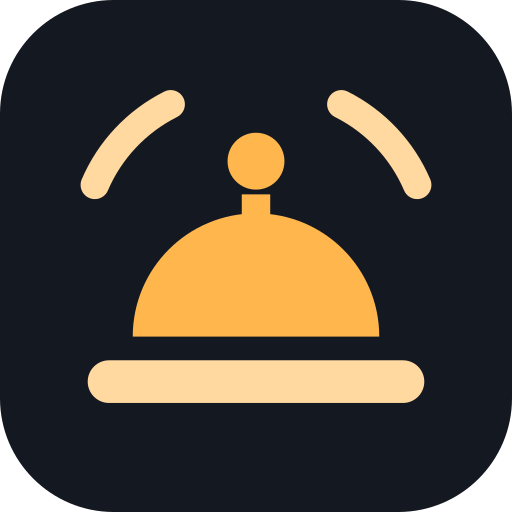

<div align="center">

  

  <h1>Bing-Bong for Home Assistant</h1>

  <p>
    Home Assistant quick bars on your Android TV — tap the bell, your controls appear.
  </p>

</div>

Bing-Bong is a friendly fork of [QuickBars by Omri Peretz (Trooped/QuickBars)](https://github.com/Trooped/QuickBars),
rebranded and reworked around a remote-first, 10-foot TV experience. It provides a
fast overlay that works over any app on your TV: quick-action bars of Home Assistant
entities, summoned by remote-control trigger keys.

**Application id:** `com.zaiemv.bingbong` — a distinct app from upstream's Play release
(`dev.trooped.tvquickbars`). Installing Bing-Bong does not touch, update, or replace an
existing QuickBars install.

## Features

- **Fast overlays** — control entities via remote-summonable quick bars over any app.
- **10-foot tile UI** (this fork) — direct D-pad manipulation of lights and media
  volume, domain accent colors, focus-ring navigation, quiet reconnect handling.
- **Key mapping** — map physical remote keys (single/double/long press) to HA actions.
- **Real-time updates** — local connection via the Home Assistant WebSocket API.
- **Camera PiPs** — live camera picture-in-picture while watching TV.
- **Rich notifications** — TV-optimized alerts with images and action buttons.

## Building

```sh
./gradlew :app:assembleDebug          # JDK 17, Android SDK required
```

Brand assets (launcher icon, adaptive layers, TV banner, Play artwork) are generated —
do not edit the PNGs by hand:

```sh
python3 scripts/gen_brand_assets.py   # needs rsvg-convert (brew install librsvg)
```

Play-listing material (store copy, permission declarations, publication checklist)
lives in [docs/play-listing.md](docs/play-listing.md).

## Attribution

Bing-Bong is based on **[QuickBars for Home Assistant](https://github.com/Trooped/QuickBars)**,
created by **Omri Peretz** ([omriperetz.dev](https://omriperetz.dev)) and released under
the GNU General Public License v3.0. Enormous thanks to him and the QuickBars
contributors — the overlay engine, HA WebSocket layer, key-trigger accessibility
service, camera PiP, and notification system all originate there. If you want the
original app, get [QuickBars on Google Play](https://play.google.com/store/apps/details?id=dev.trooped.tvquickbars)
and visit [quickbars.app](https://quickbars.app/).

This fork modifies the upstream work (2026): new identity (name, application id, icon,
banner), and a TV-experience overhaul of the overlay UI (shared tile system, direct
D-pad value adjustment, domain accent palette, entity-selector search). Upstream
copyright remains with the original authors; changes are © the Bing-Bong contributors.

## License

Distributed under the **GNU General Public License v3.0 (GPLv3)**, the same license as
upstream. See [`LICENSE`](LICENSE).

**Source availability:** GPLv3 requires that everyone who receives a Bing-Bong binary
(including via Google Play) can obtain the corresponding source code. This repository
must therefore be **public** (or a public source mirror must exist and be linked from
the Play listing and the in-app About screen) *before* any binary is distributed on
the Play Store.

## Contact

- Fork (Bing-Bong): [github.com/zaieeeem/QuickBars](https://github.com/zaieeeem/QuickBars)
- Upstream (QuickBars): [github.com/Trooped/QuickBars](https://github.com/Trooped/QuickBars) —
  please report upstream feature questions there, and Bing-Bong-specific issues here.
